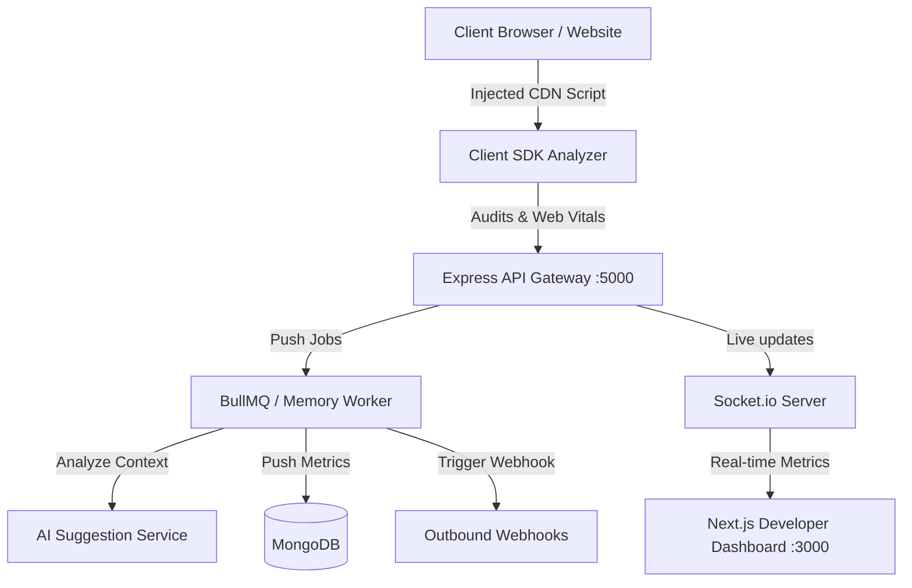

# Antigravity JS: CDN-Based Frontend Code Analyzer

Antigravity JS is a production-ready developer platform (built on the MERN stack) that monitors website health in real time. By including a lightweight CDN-hosted script tag, developers can automatically audit runtime errors, performance bottlenecks, accessibility standard violations, mixed content security risks, and code styling patterns.

The platform is designed similarly to a lightweight, automated combination of **Google Lighthouse**, **ESLint**, **Chrome DevTools**, and **Sentry** running directly inside client web browsers.

---

## 1. Core Architecture & Telemetry Pipeline



1. **Client SDK (`sdk/`)**: Included via a simple HTML `<script>` tag. Traverses the DOM tree, observes styling sheets, overrides exception boundaries, captures Google Web Vitals, and performs static code diagnostics.
2. **API Gateway (`backend/`)**: Ingests JSON telemetry reports, authenticates client project IDs via API Keys, broadcasts real-time socket events, and puts diagnostic items into the queue.
3. **Background Worker & AI Engine**: Performs asynchronous processing (preventing request blocking). Invokes the AI recommendation service to generate code refactoring suggestions, and dispatches webhook alerts.
4. **Developer Dashboard (`dashboard/`)**: A Next.js interface providing visual graphs of performance vitals, filterable issues logs, AI recommendation cards, and project security settings.

---

## 2. Using it in Real-World Production Projects

To audit any live production website:

1. **Obtain your SDK Script Snippet**:
   Register your project inside the developer dashboard to generate a unique API Key and script snippet:
   ```html
   <script 
     src="https://cdn.your-domain.com/sdk/analyzer.js" 
     data-project-id="your_project_id_here" 
     data-env="production">
   </script>
   ```

2. **Paste it in your HTML Template**:
   Insert the script block at the very top of your document `<head>` (before other scripts). This guarantees that the SDK overrides global exception listeners and captures performance timings from the start of the page load.

3. **Configure Alert Webhooks**:
   In the dashboard, configure your webhook endpoint (e.g. `https://api.yourcompany.com/slack-alerts`). The platform will automatically push JSON payloads when critical accessibility issues or script crashes occur.

---

## 3. Working on Local Projects

**Yes, the platform works on local projects.** Whether you are building an app on `http://localhost:3000` or opening a raw static HTML file (e.g., `file:///C:/Users/.../index.html`), the SDK will analyze and report issues.

### Steps to Run and Test Locally

#### Step A: Run the Backend API
1. Ensure your local **MongoDB** server is running.
2. Open your terminal and start the server:
   ```bash
   cd backend
   npm install
   npm run seed  # Generates default user (admin@example.com / password123)
   npm run dev   # Starts server on http://localhost:5000
   ```

#### Step B: Start the Next.js Dashboard
1. Open a new terminal and run:
   ```bash
   cd dashboard
   npm install
   npm run dev   # Starts dev dashboard on http://localhost:3000
   ```
2. Open `http://localhost:3000` in your web browser and log in using the seeded credentials.

#### Step C: Inject the Local Script
For local files, point your integration script to the local backend address:
```html
<script 
  src="http://localhost:5000/sdk/analyzer.js" 
  data-project-id="demo_proj_1" 
  data-env="development">
</script>
```

Open your local project file in any browser tab. The SDK will run audits and immediately update the live telemetry feed in your dashboard!
